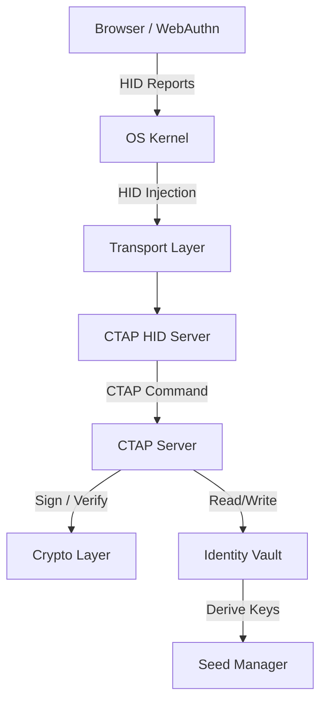

# Design: Architecture

## System Overview

`virtual-fido` is composed of several layers that work together to emulate a hardware security key.

### Component Breakdown

1.  **Protocol Implementation**: Core logic for FIDO2 (CTAP2) and U2F (CTAP1).
2.  **Device Emulation (Transport)**: Platform-specific HID injection.
3.  **Identity & Key Management**: Seed-based credential storage and derivation.
4.  **User Interaction**: CLI and approval prompts.

## Architectural Flow

## Platform Matrix

| Feature | Linux | macOS (DKIT) | macOS (VHID) | Windows (VM) |
| :--- | :--- | :--- | :--- | :--- |
| **Driver** | UHID | System Extension | CoreHID | USBIP |
| **Status** | Stable | Stable | Stable | Via USBIP |
| **Build Tools** | Go | Go + Clang | Go + Swift | Go |

## Sequence Diagrams

### VirtualHID Flow (macOS)

### DriverKit Flow (macOS)

### PureGo Proposed Flow

